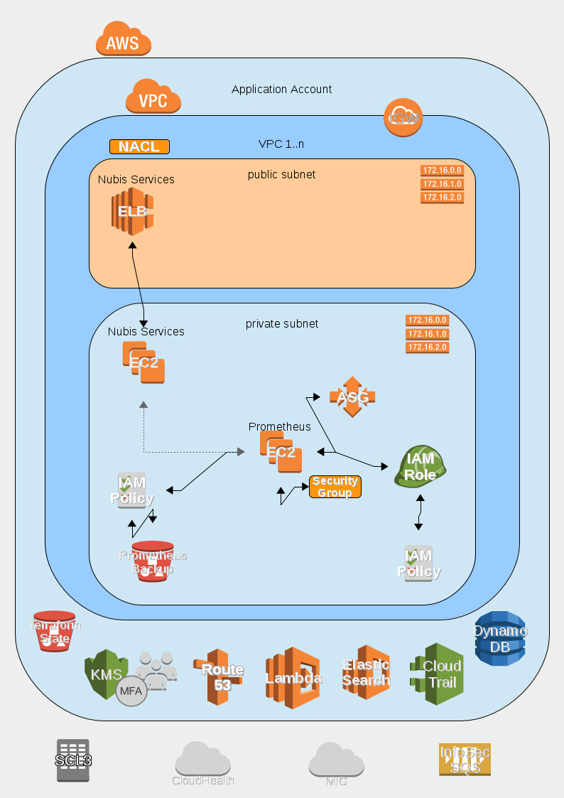

# nubis-prometheus

## Prometheus Deployment
The Prometheus project is designed to be deployed into a standard Nubis Account. It takes advantage of the standard deployment found [here](https://github.com/nubisproject/nubis-docs/blob/master/DEPLOYMENT_OVERVIEW.md). For further specifics about Prometheus consult the documentation [here](https://prometheus.io/docs/introduction/overview/.

### Deployment Diagram

**NOTE**: The line colors are representative and are for readability only. They are not intended to indicate any underlying protocol or specific communication details.

### Deployment Notes
The Nubis Prometheus deployment consists of:
 - A single EC2 instance acting as a Prometheus server
 - An Auto Scaling group to provide resiliency
 - A S3 log bucket where backups are stored

### Exporter Ports

Prometheus scrapes different kind of exporters, as it discovers them. Each of them needs a distinct TCP port for it, and here is our current list:

| Exporter               | Port | Discovery                    |
| ---                    | :---:|           ---                |
| Node                   | 9100 | sd:datadog sd:node-exporter  |
| Fluentd                | 9101 | sd: fluentd                  |
| Consul Statd           | 9102 | sd: consul                   |
| Apache                 | 9103 | sd:apache sd:apache-exporter |
| ElasticSearch          | 9105 | sd:es                        |
| Squid                  | 9106 | sd:proxy                     |
| Consul                 | 9107 | sd: consul                   |
| Fluentd Apache         | 9108 | sd:apache sd:apache-exporter |
| Cloudwatch             | 9116 | Internal                     |
| Cloudwatch Billing     | 9117 | Internal                     |

### Deployment Resources
Details for the deployment including; naming conventions, relationships, permissions, etcetera, can be found in the [Terraform template](nubis/terraform/main.tf) used for deployment. Links to specific resources can be found in the following table.

|Resource Type|Resource Title|Code Location|
|-------------|--------------|-------------|
|atlas_artifact|nubis-prometheus|[nubis/terraform/main.tf#L6](nubis/terraform/main.tf#L6)|
|aws_s3_bucket|prometheus|[nubis/terraform/main.tf#L35](nubis/terraform/main.tf#L35)|
|aws_security_group|prometheus|[nubis/terraform/main.tf#L58](nubis/terraform/main.tf#L58)|
|aws_iam_instance_profile|prometheus|[nubis/terraform/main.tf#L128](nubis/terraform/main.tf#L128)|
|aws_iam_role|prometheus|[nubis/terraform/main.tf#L142](nubis/terraform/main.tf#L142)|
|aws_iam_role_policy|prometheus|[nubis/terraform/main.tf#L169](nubis/terraform/main.tf#L169)|
|aws_launch_configuration|prometheus|[nubis/terraform/main.tf#L214](nubis/terraform/main.tf#L214)|
|aws_autoscaling_group|prometheus|[nubis/terraform/main.tf#L254](nubis/terraform/main.tf#L254)|
